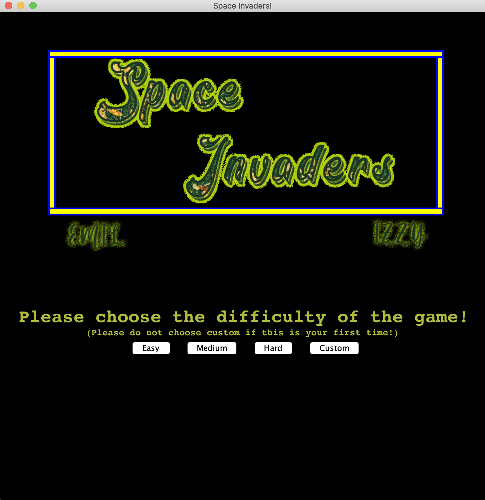
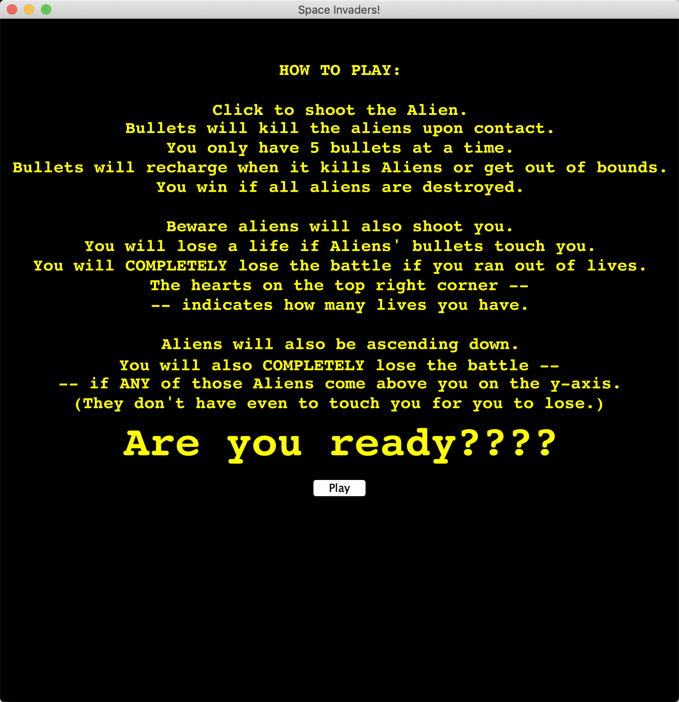
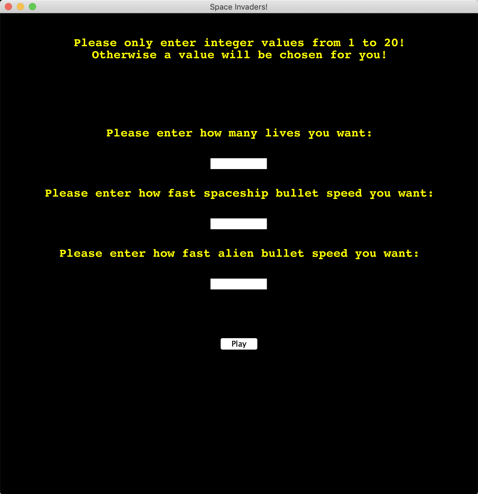
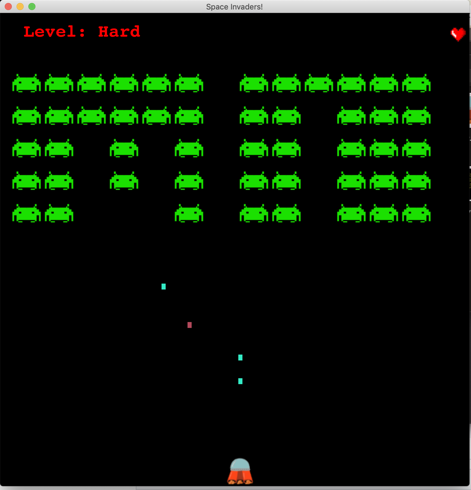
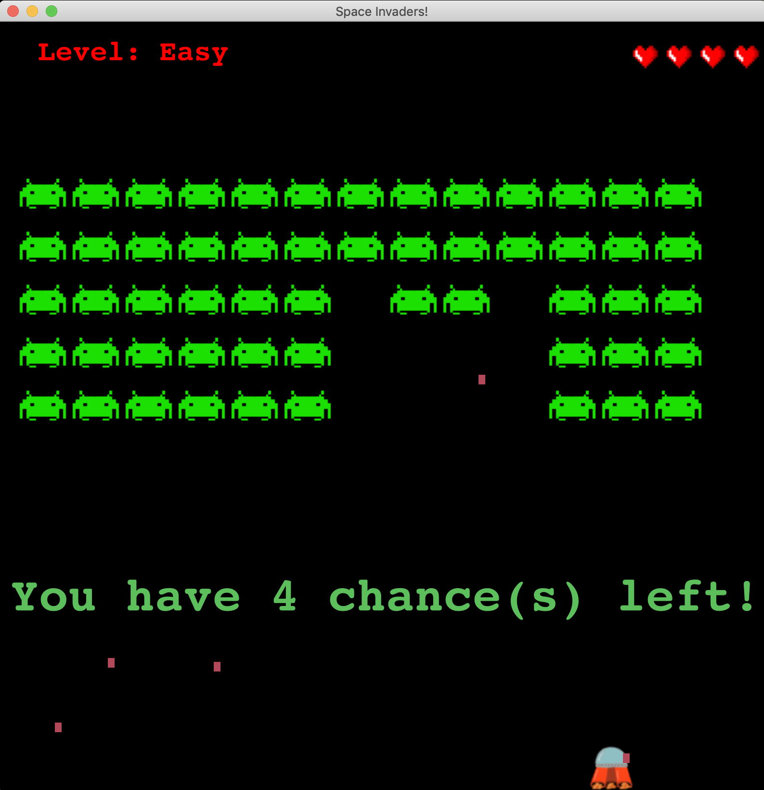
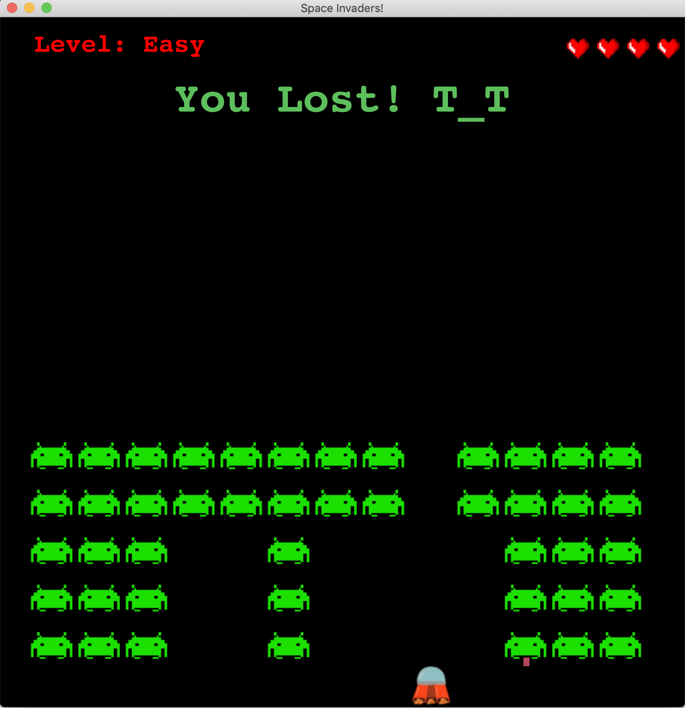

# COMP 127-02 Final Project Spring 2020: Space Invaders.
Team members:
- Emil Le
- Izzy Valdivia

# Intention of the project: 
- This is a replica of the classic Space Invaders game.
- You are the spaceship that is trying to kill all the aliens invading earth by shooting bullets at them.
- The aliens will comeback at you by shooting back.
- Try to kill the aliens fast, or they will come too close to you and invade earth!!

# Instruction for setting up:
- You will need to import 127-shared module.
- You can fork it from [here](https://github.com/mac-comp127-s20/127-shared).
- You can play the game by running the SpaceInvaders class containing the main method. 

# How to interact with the graphics:
- Click button to choose the appropriate events. 
- For examples, click "easy", "medium" or "hard" button will lead you to the pre-built levels. 
- You can customize by clicking the "custom" button.

- After choosing the difficulty, it will leads to a window includes of instruction to how to play the game. 
- Click "play" to play the game.

- If you choose custom, enter the values that you want to customize (number of lives, spaceship bullet speed, alien bullet speed).
- Values must be integers from 1 to 20, if you don't follow the rules, a pre-determined values will be chosen for you.

- When you win or lose the game, the canvas will show announcement context, and the canvas windows will CLOSE.

# HOW TO PLAY:
Your goals: 
* Move the spaceship by moving your cursors.
* Click to shoot the Alien. 
* Bullets will kill the aliens upon contact.
* You only have 5 bullets at a time.
* Bullets will recharge when it kills Aliens or get out of bounds.\
* You win if all aliens are destroyed.

\
Your obstacles:
* Beware aliens will also shoot you.
* You will lose a life if Aliens' bullets touch you.
* You will COMPLETELY lose the battle if you ran out of lives.
* For example:

* The hearts on the top right corner indicates how many lives you have.
* Aliens will also be ascending down.
* You will also COMPLETELY lose the battle if ANY of those Aliens come above you on the y-axis (They don't have even to touch you for you to lose).
* For example:

